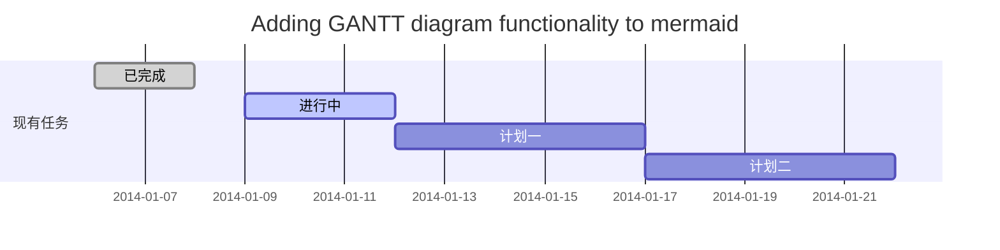
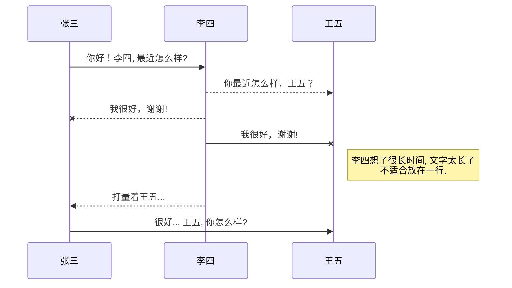
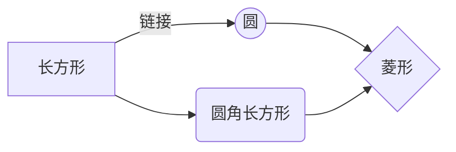

# Typora 的 Markdown

## 概览

**Markdown**由[Daring Fireball](http://daringfireball.net/)创建；最初的指南在[这](http://daringfireball.net/projects/Markdown/syntax)。不过，不同的解析器或编辑器使用的语法也不尽相同。**Typora**使用的是[GitHub Flavored Markdown][GFM]。

[toc]

## 块元素

### 段落和换行

段落是指一行或多行连续的文本。在 Markdown 源代码中，段落由两行或多行空行隔开。在 Typora 中，只需一个空行（按一次 "Return "键）即可创建一个新段落。

按 `Shift` + `Return` 键创建一个单换行符。大多数其他 Markdown 分析程序都会忽略单换行符，所以为了让其他 Markdown 分析程序识别你的换行符，你可以在行尾留两个空格，或者插入 `<br/>`。

### 标题

标题在行首使用 1-6 个散列 (`#`)字符，分别对应 1-6 级标题。例如

``` markdown
# 这是一个 H1

## 这是一个 H2

###### 这是 H6
```

在 Typora 中，输入 "#"，然后输入标题内容，按 "Return "键即可创建标题。

### 分块

Markdown 使用电子邮件风格的 > 字符进行分块引用。它们显示为

``` markdown
> 这是一个有两个段落的楷体引号。这是第一段。
>
> 这是第二段。Vestibulum enim wisi, viverra nec, fringilla in, laoreet vitae, risus.


> 这是另一个带一个段落的分段引号。有三个空行隔开了两个 blockquote。
```

在 Typora 中，输入">"后的引号内容将生成一个引号块。Typora 会为您插入适当的">"或换行。通过添加更多级的">"，可实现嵌套引号（一个引号内包含另一个引号）。

> 这是一个有两个段落的楷体引号。这是第一段。
>
> 这是第二段。Vestibulum enim wisi, viverra nec, fringilla in, laoreet vitae, risus.


> 这是另一个带一个段落的分段引号。有三个空行隔开了两个 blockquote。

### 列表

输入 `* list item 1` 将创建一个无序列表 - `*` 符号可以用 `+` 或 `-` 代替。

输入 `1. list item 1` 将创建一个有序列表 - 其 Markdown 源代码如下：

``` markdown
## 无序列表
* 红色
* 绿色
* 蓝色

## 排序列表
1.  红色
2.	绿色
3.	Blue
```

### 任务清单

任务列表是将项目Markdown为 [ ] 或 [x]（未完成或已完成）的列表。例如

``` markdown
- [ ] 任务列表项目
- [ ] 需要列表语法
- [ ] 正常**格式**，@注释，#1234 参考文献
- [ ] 未完成
- [x] 已完成
```

点击项目前的复选框可更改完成/未完成状态。

- [ ] 任务列表项目
- [ ] 需要列表语法
- [ ] 正常**格式**，@注释，#1234 参考文献
- [ ] 未完成
- [x] 已完成

### 代码块

Typora 仅支持 `GitHub Flavored Markdown` 中的代码块。不支持 Markdown 中的原始代码块。

使用代码块很简单：输入 \`\`\` 然后按下 `return`。在 \`\`\` 后面添加一个可选的语言标识符，然后我们就可以通过语法高亮来运行它了：

````markdown
一个例子:

```js
function test() {
  console.log("notice the blank line before this function?");
}
```

语法高亮:
```ruby
require 'redcarpet'
Markdown = Redcarpet.new("Hello World!")
puts Markdown.to_html
```
````

一个例子:

```js
function test() {
  console.log("notice the blank line before this function?");
}
```

语法高亮:
```ruby
require 'redcarpet'
Markdown = Redcarpet.new("Hello World!")
puts Markdown.to_html
```

### 数学表达式

您可以使用**MathJax**呈现*LaTeX*数学表达式。

要添加数学表达式，请输入 `$$` 并按 `return`键。这将触发一个接受 *Tex/LaTex* 源的输入框。例如


$$
\mathbf{V}_1 \times \mathbf{V}_2 =  \begin{vmatrix}
\mathbf{i} & \mathbf{j} & \mathbf{k} \\
\frac{\partial X}{\partial u} &  \frac{\partial Y}{\partial u} & 0 \\
\frac{\partial X}{\partial v} &  \frac{\partial Y}{\partial v} & 0 \\
\end{vmatrix}
$$


在Markdown符源文件中，数学块是由一对`$$`Markdown包裹的*LaTeX*表达式：

``` markdown
$$
\mathbf{V}_1 \times \mathbf{V}_2 = \begin{vmatrix}
\mathbf{i} & \mathbf{j} & \mathbf{k}\\
\frac{partial X}{partial u} & \frac{partial Y}\{partial u} & 0 \
\frac{partial X}{partial v} & \frac{partial Y}\{partial v} & 0 \
\end{vmatrix}
$$
```

您可以在 [此处](https://support.typora.io/Math/) 了解更多详情。

### 表格

输入 `| First Header | Second Header |` 并按`return`键。这将创建一个有两列的表格。

创建表格后，将焦点放在表格上会打开表格的工具栏，在工具栏中可以调整表格大小、对齐或删除表格。还可以使用上下文菜单复制和添加/删除单个列/行。

下面介绍了表格的全部语法，但不需要详细了解全部语法，因为 Typora 会自动生成表格的 Markdown 源代码。

在Markdown符源代码中，它们看起来像

``` markdown
| First Header  | Second Header |
| ------------- | ------------- |
| Content Cell  | Content Cell  |
| Content Cell  | Content Cell  |
```

您还可以在表格中加入链接、粗体、斜体或删除线等内联Markdown符。

| First Header | Second Header |
| ------------ | ------------- |
| Content Cell | Content Cell  |
| Content Cell | Content Cell  |

最后，通过在标题行中加入冒号 (`:`)，可以将该列的文本定义为左对齐、右对齐或居中对齐：

``` markdown
| Left-Aligned  | Center Aligned  | Right Aligned |
| :------------ |:---------------:| -----:|
| col 3 is      | some wordy text | $1600 |
| col 2 is      | centered        |   $12 |
| zebra stripes | are neat        |    $1 |
```

最左边的冒号表示左对齐列；最右边的冒号表示右对齐列；两边都是冒号表示居中对齐列。

| Left-Aligned  | Center Aligned  | Right Aligned |
| :------------ | :-------------: | ------------: |
| col 3 is      | some wordy text |         $1600 |
| col 2 is      |    centered     |           $12 |
| zebra stripes |    are neat     |            $1 |

### 脚注

``` 
您可以像这样创建脚注[^脚注]。

[^脚注]：这里是**脚注的**文本。
```

将产生：

您可以像这样创建脚注[^脚注]。

[^脚注]: 这里是**脚注的**文本。

将鼠标悬停在 "脚注 "上标上，可查看脚注内容。

### 分段线

在空行上输入 `***` 或 `----`，然后按 `return` 键，就会画出一条水平线。

### YAML 正文

Typora 现在支持 [YAML Front Matter](http://jekyllrb.com/docs/frontmatter/)。在文章顶部输入`---`，然后按 `Return`，即可引入元数据块。或者，你也可以从 Typora 的顶部菜单插入元数据块。


### 目录 (TOC)

输入`[toc]`，然后按 `Return` 键。这将创建一个 "目录 "部分。目录从文档中提取所有标题，其内容会在您添加内容时自动更新。

## 跨元素

输入后，跨元素将立即被解析和呈现。将光标移动到这些跨元素中间，会将这些元素展开为 Markdown 源代码。下面是每个跨元素的语法说明。

### 链接

Markdown 支持两种链接样式：内联和引用。

在这两种样式中，链接文本都用[方括号]分隔。

要创建内嵌链接，请在链接文本的结尾方括号后使用一组常规括号。在括号内，输入您希望链接指向的 URL，以及可选的链接标题，并用引号括起来。例如

``` markdown
这是 [示例](http://example.com/ "标题") 内嵌链接。

[此链接](http://example.net/) 没有标题属性。
```

将产生

这是 [示例](http://example.com/ "Title") 内嵌链接。(`<p>This is <a href="http://example.com/" title="Title">`)

[此链接](http://example.net/) 没有标题属性。( 等价于`<p><a href="http://example.net/">此链接</a> 没有标题属性`)

### 内部链接

**您可以将 href 设置为标题**，这样就可以创建一个书签，让您点击后跳转到该部分。例如

Command（在 Windows 上：Ctrl）+ 单击 [此链接](#跨元素) 将跳转到标题 `跨元素`。要查看如何书写，请移动光标或按住 `⌘` 键单击该链接，将元素展开为 Markdown 源代码。

### 参考链接

参考样式链接使用第二组方括号，在方括号内放置您选择的标签来标识链接：

``` markdown
这是[示例][id]参考样式链接。

然后，在文档的任何地方，像这样在一行中定义链接标签：

[id]： http://example.com/ "此处为可选标题"
```

在 Typora 中，它们将这样显示：

这是[示例][id]参考样式链接。

[id]: 	http://example.com/ "此处为可选标题"

隐式链接名称快捷方式允许你省略链接名称，在这种情况下，链接文本本身就会被用作名称。只需使用一组空的方括号即可，例如，要将 "Google "链接到 google.com 网站，只需写入以下内容即可：

``` markdown
[Google][]
然后定义链接：

[Google]: http://google.com/
```

在 Typora 中，单击链接可展开链接进行编辑，而命令+单击则可在网页浏览器中打开超链接。

[Google][]
然后定义链接：

[Google]: http://google.com/

### URL

Typora 允许您将 URL 作为链接插入，并用 `<`brackets`>` 包装。

`<i@typora.io>` 变成 <i@typora.io>。

Typora 还会自动链接标准 URL，例如： www.google.com 。

### 图片

图片的语法与链接类似，但需要在链接开始前添加一个 `!`插入图片的语法如下：

``` markdown


```

您可以使用拖放功能从图片文件或网络浏览器中插入图片。你可以通过点击图片来修改Markdown符源代码。如果使用拖放添加的图片与当前编辑的文档位于同一目录或子目录下，则会使用相对路径。

如果使用 Markdown 来构建网站，可以在 YAML Front Matters 中使用属性 `typora-root-url` 为本地计算机上的图片预览指定一个 URL 前缀。例如，在 YAML Front Matters 中输入`typora-root-url:/User/Abner/Website/typora.io/`，然后``将在 Typora 中被视为``。

您可以在 [此处](https://support.typora.io/Images/) 了解更多详情。

### 斜体

Markdown 将星号 (`*`) 和下划线 (`_`) 视为强调符号。用一个 `*` 或 `_` 包起来的文本将用 HTML `<em>` 标签包起来。例如

``` markdown
*单个星号*

_单下划线_
```

输出：

*单个星号*

_单下划线_

GFM 将忽略单词中的下划线，下划线通常用于代码和名称中，比如这样：

> wow_great_stuff
>
> do_this_and_do_that_and_another_thing.

要在星号或下划线本应用作强调分隔符的位置产生一个星号或下划线，可以反斜杠转义：

``` markdown
\*this text is surrounded by literal asterisks\*
```

\*this text is surrounded by literal asterisks\*

Typora 建议使用 `*` 符号。

### 粗体

双 `*`或`_`会导致其所包含的内容被 HTML`<strong>`Markdown包裹，例如

``` markdown
**双星号**

__双下划线__
```

输出：

**双星号**

__双下划线__

Typora 推荐使用 `**` 符号。

### 代码

要表示代码的内联跨度，请用反`将其包住。与预先格式化的代码块不同，代码跨度表示正常段落中的代码。例如

``` markdown
使用 `printf()` 函数。
```

将产生

使用 `printf()` 函数。

### 删除线

GFM 添加了创建删除线文本的语法，这是标准 Markdown 中缺少的。

`~~Mistaken text.~~` 变成 ~~Mistaken text.~~

### 下划线

下划线由原始 HTML 提供支持。

`<u>Underline</u>` 变成 <u>Underline</u> 。

### Emoji :smile:

输入语法为 `:smile:`的表情符号。

用户可以按 "ESC "键触发表情符号自动完成建议，或在偏好设置面板上启用后自动触发。此外，通过菜单栏中的 "编辑"->"表情符号和符号"（macOS），还可直接输入 UTF-8 表情符号字符。

### 内联公式

要使用此功能，请首先在 "首选项 "面板 -> "Markdown 扩展语法"选项卡中启用它。然后，使用 `$` 来封装 TeX 命令。例如：`$\lim_{x \to \infty}\exp(-x) = 0$` 将被渲染为 LaTeX 命令。

要触发内联数学的内联预览：输入"$"，然后按`ESC`键，再输入一条 TeX 命令。

您可以在 [此处](https://support.typora.io/Math/) 了解更多详情。

### 下标

要使用此功能，请首先在 "首选项 "面板 -> "Markdown 扩展语法 "选项卡中启用它。然后，使用 `~` 对下标内容进行包装。例如：`H~2~O`, `X~long\ text~`/

### 上标

要使用此功能，请首先在 "首选项 "面板 -> "Markdown 扩展语法 "选项卡中启用它。然后，使用 `^` 来包装上标内容。例如：`X^2^`。

### 高亮

要使用此功能，请首先在 "首选项 "面板 -> "Markdown 扩展语法 "选项卡中启用它。然后，使用 `==` 来包装高亮内容。例如：`==高亮==`。

## HTML

您可以使用 HTML 来样式化纯 Markdown 不支持的内容。例如，使用 `<span style="color:red">红色文本</span>` 添加<span style="color:red">红色文本</span>。

### 嵌入内容

有些网站提供基于 iframe 的嵌入代码，您也可以将其粘贴到 Typora 中。例如

```Markdown
<iframe src="https://www.luogu.com.cn/" scrolling="no" border="0" frameborder="no" framespacing="0" allowfullscreen="true" height="512"></iframe>
```

<iframe src="https://www.luogu.com.cn/" scrolling="no" border="0" frameborder="no" framespacing="0" allowfullscreen="true" height="625"></iframe>

### 视频

您可以使用 `<video>` HTML 标签嵌入视频。例如

```Markdown
<video src="xxx.mp4" />
```

### 音频

您可以使用 `<audio>` HTML 标签嵌入音频。例如

```Markdown
<audio src="xxx.mp3" />
```

### 其他 HTML 支持

您可以在 [此处](https://support.typora.io/HTML/) 了解更多详情。

[GFM]: https://help.github.com/articles/github-flavored-markdown/

## 更多

### 甘特图



- 关于 **甘特图** 语法，参考 [这儿][2],

### UML 图表

可以使用UML图表进行渲染。 [Mermaid](https://mermaidjs.github.io/). 例如下面产生的一个序列图：



这将产生一个流程图。:



- 关于 **Mermaid** 语法，参考 [这儿][3],